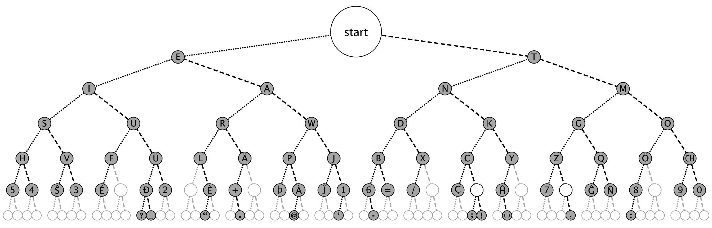

# TRINIT_1nmLaysChips_EC01

## Morse Code Decoder using Digital Logic  

### Introduction    
Designing Morse Decoder according to the ITU standards with digital logic and simulated in Proteus.  

Morse code is an old system of encoding messages that is used to send telegraphic information using signals and rhythm. In written communication, Morse code uses dots and dashes to represent a limited number of alphabet letters, numbers, punctuation and special characters of a given message. When messages are sent by sound, radio signals or light flashes, dots are short beeps or clicks or flashes, and dashes are longer ones.  

### Our Approach

The Morse Tree is a very intuitive way to decode the Morse Code, with one value added serially at a time.  
The Huffman Code basically does the same, but the cost is less. An example is the encoding alphabet of Morse code, where a 'dash' takes longer to send than a 'dot', and therefore the cost of a dash in transmission time is higher. Therefore, if we somehow nullify this cost, the working is similar to the latter.

A Huffman code is an entropy code that encodes each symbol of an alphabet
with a bit string. Frequently used symbols are encoded with short bit strings
while infrequently used symbols are encoded with longer bit strings. To be able
to distinguish short bit strings from the first parts of longer bit strings, each
short bit string must not be used as a prefix for any longer bit string. The net
result is data compression; that is, a typical sequence of symbols is encoded into
fewer bits than would be required if all symbols were encoded with the same
number of bits

In morse code also  the bits have been code based on frequency , so we can use huffman decoding technique.

  

__*Fig 1. The Morse Tree*__

The address of the current table node is held in the node register. When type is asserted — indicating a terminal node — node is set to the value of the next input bit (which selects one of the two children of the root to restart the search), the value field from the table is enabled into the output register, and oval is asserted on the following cycle. This outputs the current symbol and starts the machine at one of the children of the root depending on the first bit of the next symbol. If type is not assereted — indicating an internal node — the input value is combined with the value field from the table to select the left or right child of the current node — traversing the tree. The input value provides the least significant bit of the node address while the remaining bits come from the value field of the table.

  
__*Fig 2. Block Diagram for traversing the tree*__

#### About Morse Code 

  
__*Fig 3. International Morse Code*__

| Feature           | Number of pulse |
| ----------------- | --------------- |
| dot               | 1               |
| symbol spacing    | 1               |
| dash              | 3               |
| character spacing | 3               |
| word spacing      | 7               |

### CIRCUIT

We have used Universal Shift Registers to traverse the Tree, stored in the ROM(IC 2732).  
Made and run bin.py to create a binary for storing the tree(morse.bin)

#### Timing :

In this part of the circuit we interpret the input tell the feature/type of input . We have used a counter which is reset when the input is toggled. Using this we calculate for how many clock cycles the input remains zero or one and thus we infer its type.

#### Truth Table

 It clearly shows the values for all possible inputs and outputs.

#### The Tree Traversal 

| Feature           | Action                                         |
| ----------------- | ---------------------------------------------- |
| dot               | go left , new address = 2* current address +1  |
| symbol spacing    | Used as clock for circuits                     |
| dash              | go right , new address = 2* current address +2 |
| character spacing | Reset the address shift register               |
| word spacing      | -----                                          |

#### Test cases : 

| Sentence                                    | Morse code                                                   | Pulse |
| ------------------------------------------- | ------------------------------------------------------------ | ----- |
| Electronics                                 | . .-.. . -.-. - .-. --- -. .. -.-. ...                       |       |
| 299792458                                   | ..--- ----. ----. --... ----. ..--- ....- ..... ---..        |       |
| The quick brown fox jumps over the lazy dog | - .... . ....... --.- ..- .. -.-. -.- ....... -... .-. --- .-- -. ....... ..-. --- -..- ....... .--- ..- -- .--. ... ....... --- ...- . .-. ....... - .... . ....... .-.. .- --.. -.-- ....... -.. --- --. |       |
| 28.6139 N, 77.2090 E                        | ..--- ---.. .-.-.- -.... .---- ...-- ----. ....... -. --..-- ....... --... --... .-.-.- ..--- ----- ----. ----- ....... . |       |
#### Final Circuit :

References:

1. https://web.stanford.edu/class/archive/ee/ee108a/ee108a.1082/reader/ch19to21.pdf  
2. ITU Standard International Morse Code : https://www.itu.int/dms_pubrec/itu-r/rec/m/R-REC-M.1677-1-200910-I!!PDF-E.pdf
